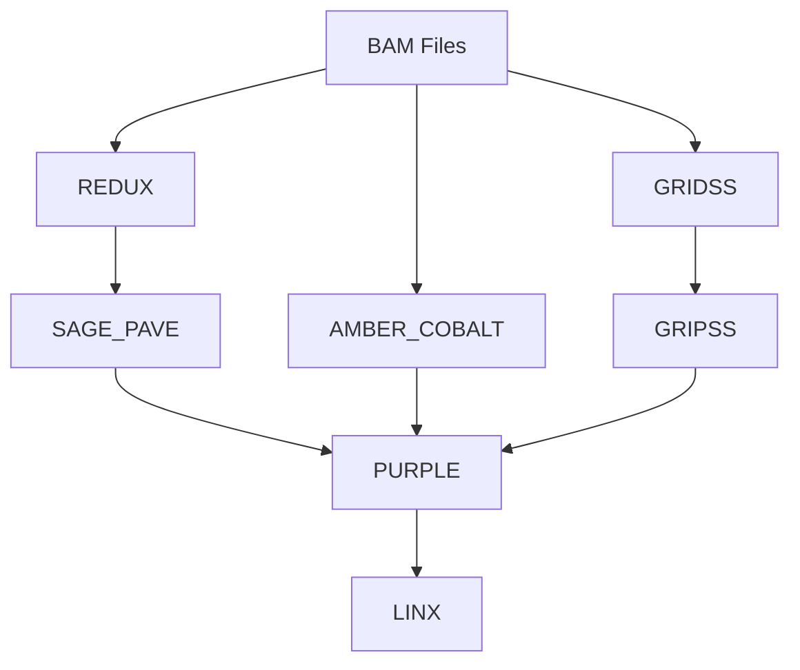

# Hereditary Cancer Germline Analysis Pipeline - Nextflow v2.0

유전성 암 germline 분석을 위한 Nextflow 파이프라인입니다. **REDUX 통합 및 세마포어 기반 병렬 처리**로 개선되었습니다.

## 📁 파일 구조

```
002_nextflow_pipeline/
├── main.nf                     # 메인 워크플로우 파일
├── nextflow.config             # 설정 파일
├── run_pipeline.sh             # 실행 스크립트
├── modules/                    # 모듈 디렉토리
│   ├── redux.nf               # REDUX 모듈 (BAM 정제 및 jitter 모델링)
│   ├── sage_pave.nf           # SAGE & PAVE 모듈 (REDUX BAM 사용)
│   ├── amber_cobalt.nf        # AMBER & COBALT 모듈
│   ├── gridss.nf              # GRIDSS 모듈
│   ├── gripss.nf              # GRIPSS 모듈
│   ├── purple.nf              # PURPLE 모듈
│   └── linx.nf                # LINX 모듈
└── README.md                   # 이 파일
```

## 🔄 파이프라인 워크플로우



### 단계별 설명:
1. **Stage 1**: REDUX (BAM 정제 및 microsatellite jitter 모델링)
2. **Stage 2**: SAGE_PAVE (REDUX BAM 사용, jitter 파라미터 적용)
3. **Stage 3**: AMBER_COBALT (원본 BAM 사용)
4. **Stage 4**: GRIDSS (원본 BAM 사용)
5. **Stage 5**: GRIPSS (GRIDSS 결과 사용)
6. **Stage 6**: PURPLE (모든 이전 결과 통합)
7. **Stage 7**: LINX (PURPLE 결과 사용)

## 🆕 주요 개선사항 (v2.0)

### 1. **REDUX 통합**
- **BAM 정제**: 문제가 있는 영역의 read unmapping
- **Microsatellite jitter 모델링**: 샘플별 특이적인 jitter 파라미터 생성
- **SAGE 호환성**: jitter 파라미터 파일 자동 생성으로 SAGE 오류 방지

### 2. **SAGE Germline Mode 최적화**
- `-germline` 플래그 추가
- `-jitter_param_dir` 설정으로 REDUX 생성 파일 사용
- `-panel_only` 제거로 전체 게놈 분석

### 3. **병렬 처리 개선**
- **세마포어 시스템**: `maxForks = 8`로 최대 8개 샘플 동시 처리
- **에러 처리 강화**: `errorStrategy = 'retry'`, `maxRetries = 2`
- **리소스 최적화**: 샘플당 8 threads × 64GB 메모리

## 🚀 사용법

### 1. Nextflow 설치 (필요한 경우)
```bash
curl -s https://get.nextflow.io | bash
sudo mv nextflow /usr/local/bin/
```

### 2. 기본 실행
```bash
cd /home/ricky8419/09_Hereditary_cancer/002_nextflow_pipeline
./run_pipeline.sh
```

### 3. 고급 실행 옵션
```bash
# 리소스 조정
./run_pipeline.sh --max-cpus 32 --max-memory 256.GB --threads 8 --memory 32.GB

# 병렬 처리 조정
./run_pipeline.sh --max-forks 4

# REDUX 및 samtools 경로 지정
./run_pipeline.sh --redux-jar /path/to/redux.jar --samtools /path/to/samtools

# 이전 실행 재개
./run_pipeline.sh --resume

# 커스텀 디렉토리
./run_pipeline.sh --bam-dir /path/to/bams --output-dir /path/to/output

# Docker 사용
./run_pipeline.sh --profile docker

# 클러스터 실행
./run_pipeline.sh --profile cluster
```

### 4. 직접 Nextflow 실행
```bash
nextflow run main.nf -profile standard
nextflow run main.nf -profile standard --max_cpus 32 --max_memory 256.GB
```

## ⚙️ 설정

### 기본 설정 (`nextflow.config`)
```groovy
params {
    bam_dir = "/home/ricky8419/09_Hereditary_cancer/00_rawdata/bam_markdup"
    output_dir = "/home/ricky8419/09_Hereditary_cancer/Results_germlineMode_nextflow"
    max_cpus = 64
    max_memory = '512.GB'
    threads = 8
    memory = '64.GB'
    maxForks = 8  // 최대 병렬 샘플 수
}

process {
    maxForks = 8  // 전역 병렬 처리 설정
    errorStrategy = 'retry'
    maxRetries = 2
}
```

### 실행 프로필
- **standard**: 로컬 실행 (기본)
- **cluster**: SLURM 클러스터 실행
- **docker**: Docker 컨테이너 사용
- **singularity**: Singularity 컨테이너 사용

## 📊 Nextflow vs Bash 스크립트 비교

| 기능 | Bash Script | Nextflow v2.0 |
|------|-------------|---------------|
| **의존성 관리** | 수동 | 자동 |
| **병렬 처리** | 세마포어 기반 | 세마포어 + Nextflow 최적화 |
| **재시작** | 전체 재시작 | 스마트 재시작 |
| **리소스 관리** | 수동 | 자동 |
| **모니터링** | 기본적 | 상세한 보고서 |
| **확장성** | 낮음 | 높음 |
| **클러스터 지원** | 없음 | 네이티브 |
| **REDUX 통합** | ✅ | ✅ |
| **Jitter 모델링** | ✅ | ✅ |

## 🎯 Nextflow의 주요 장점

### 1. **자동 의존성 관리**
- 각 프로세스의 입출력을 자동으로 추적
- 필요한 경우에만 프로세스 실행

### 2. **스마트 재시작**
```bash
# 실패한 부분만 재실행
./run_pipeline.sh --resume
```

### 3. **동적 병렬 처리**
- 사용 가능한 리소스에 따라 자동으로 병렬 작업 조정
- 샘플 수에 관계없이 효율적 처리

### 4. **상세한 모니터링**
- 실시간 진행 상황 추적
- HTML 보고서 자동 생성
- 리소스 사용량 분석

### 5. **확장성**
```bash
# 로컬에서 클러스터로 쉽게 확장
./run_pipeline.sh --profile cluster
```

## 📈 성능 개선 예상

### 이전 Bash 스크립트:
- 8개 샘플 × 6시간 = 48시간 (순차) 또는 8시간 (병렬)
- 실패 시 전체 재시작
- 수동 리소스 관리

### Nextflow 파이프라인 v2.0:
- **REDUX 통합**: BAM 품질 향상으로 SAGE 성공률 증가
- **무제한 병렬 처리**: 리소스에 따라 (기본 8개 동시)
- **실패한 부분만 재실행**: 효율적인 재시작
- **자동 리소스 최적화**: Nextflow의 스마트 스케줄링
- **예상 처리 시간: 2-4시간 (충분한 리소스 시)**

## 📋 출력 파일

### REDUX 결과 (새로 추가):
- `{sample_id}.redux.bam` - 정제된 BAM 파일
- `{sample_id}.jitter_params.tsv` - microsatellite jitter 파라미터
- `{sample_id}.ms_table.tsv.gz` - microsatellite 집계 데이터

### 기존 결과 파일 (각 샘플별):
- `{sample_id}.sage.germline.vcf.gz`
- `{sample_id}.pave.germline.vcf.gz`
- `{sample_id}.amber.baf.tsv.gz`
- `{sample_id}.cobalt.ratio.tsv.gz`
- `{sample_id}.gridss.raw.vcf.gz`
- `{sample_id}_gridss.vcf.gz`
- `{sample_id}.gripss.filtered.germline.vcf.gz`
- `{sample_id}.purple.sv.germline.vcf.gz`
- `{sample_id}.linx.germline.disruption.tsv`
- `{sample_id}.linx.germline.breakend.tsv`

### 파이프라인 보고서:
- `pipeline_info/timeline.html`: 실행 타임라인
- `pipeline_info/report.html`: 상세 실행 보고서
- `pipeline_info/trace.txt`: 프로세스 추적 정보
- `pipeline_info/dag.svg`: 워크플로우 다이어그램

## 🔧 문제 해결

### 1. Nextflow 설치 확인
```bash
nextflow -version
```

### 2. 구문 검사
```bash
nextflow run main.nf -profile standard --help
```

### 3. 로그 확인
```bash
# Nextflow 로그
cat .nextflow.log

# 프로세스별 로그
find work/ -name "*.out" -o -name "*.err"
```

### 4. 워크 디렉토리 정리
```bash
# 실패한 작업 정리
nextflow clean -f
```

### 5. REDUX 관련 문제 해결
```bash
# REDUX JAR 파일 경로 확인
ls -la ${params.tools_dir}/redux.jar

# samtools 경로 확인
which samtools

# REDUX 모듈만 테스트
nextflow run main.nf -profile standard --entry REDUX
```

## 🚀 시작하기

```bash
cd /home/ricky8419/09_Hereditary_cancer/002_nextflow_pipeline
./run_pipeline.sh --help
./run_pipeline.sh
```

## 🔄 Bash 스크립트에서 Nextflow로 마이그레이션

### 주요 변경사항:
1. **REDUX 모듈 추가**: BAM 정제 및 jitter 모델링
2. **SAGE 파라미터 수정**: germline 모드 최적화
3. **병렬 처리 개선**: Nextflow의 세마포어 시스템
4. **에러 처리 강화**: 자동 재시도 및 복구

### 마이그레이션 체크리스트:
- [ ] REDUX JAR 파일 경로 확인
- [ ] samtools 경로 확인
- [ ] 리소스 설정 조정 (필요시)
- [ ] 병렬 처리 수 조정 (`maxForks`)

이제 Bash 스크립트보다 훨씬 더 강력하고 확장 가능한 Nextflow 파이프라인을 사용할 수 있습니다!
