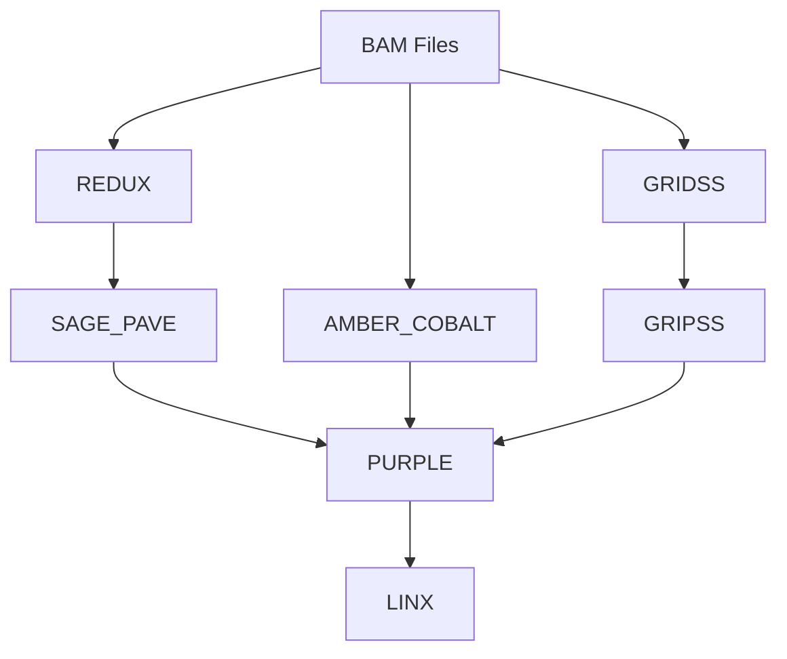

# Hereditary Cancer Germline Analysis Pipeline - Nextflow v2.0

Nextflow pipeline for hereditary cancer germline analysis, **based on the Hartwig Medical Foundation (HMF) pipeline**. This pipeline has been **improved with REDUX integration and semaphore-based parallel processing** for enhanced performance and reliability.

## 🏥 About Hartwig Medical Foundation Pipeline

This pipeline is built upon the **Hartwig Medical Foundation (HMF) pipeline**, which is a comprehensive cancer genomics analysis framework developed by the Hartwig Medical Foundation. The HMF pipeline is widely recognized for its robust variant calling, structural variant detection, and copy number analysis capabilities in cancer genomics research.

### HMF Pipeline Components Used:
- **SAGE**: Germline variant calling with microsatellite instability detection
- **PAVE**: Variant annotation and filtering
- **AMBER**: Allele-specific copy number analysis
- **COBALT**: Copy number ratio analysis
- **GRIDSS**: Structural variant detection
- **GRIPSS**: Structural variant filtering and annotation
- **PURPLE**: Copy number and structural variant integration
- **LINX**: Driver gene analysis and fusion detection

### Enhancements Over Original HMF Pipeline:
- **REDUX Integration**: Advanced BAM refinement and microsatellite jitter modeling
- **Nextflow Implementation**: Improved workflow management and parallel processing
- **Germline Mode Optimization**: Specialized for hereditary cancer analysis
- **Enhanced Error Handling**: Robust retry mechanisms and resource management

## 📁 File Structure

```
002_nextflow_pipeline/
├── main.nf                     # Main workflow file
├── nextflow.config             # Configuration file
├── run_pipeline.sh             # Execution script
├── modules/                    # Modules directory
│   ├── redux.nf               # REDUX module (BAM refinement and jitter modeling)
│   ├── sage_pave.nf           # SAGE & PAVE module (using REDUX BAM)
│   ├── amber_cobalt.nf        # AMBER & COBALT module
│   ├── gridss.nf              # GRIDSS module
│   ├── gripss.nf              # GRIPSS module
│   ├── purple.nf              # PURPLE module
│   └── linx.nf                # LINX module
└── README.md                   # This file
```

## 🔄 Pipeline Workflow



### Stage Descriptions:
1. **Stage 1**: REDUX (BAM refinement and microsatellite jitter modeling)
2. **Stage 2**: SAGE_PAVE (using REDUX BAM, applying jitter parameters)
3. **Stage 3**: AMBER_COBALT (using original BAM)
4. **Stage 4**: GRIDSS (using original BAM)
5. **Stage 5**: GRIPSS (using GRIDSS results)
6. **Stage 6**: PURPLE (integrating all previous results)
7. **Stage 7**: LINX (using PURPLE results)

## 🆕 Major Improvements (v2.0)

### 1. **REDUX Integration**
- **BAM Refinement**: Read unmapping for problematic regions
- **Microsatellite Jitter Modeling**: Sample-specific jitter parameter generation
- **SAGE Compatibility**: Automatic jitter parameter file generation to prevent SAGE errors

### 2. **SAGE Germline Mode Optimization**
- Added `-germline` flag
- `-jitter_param_dir` configuration to use REDUX generated files
- Removed `-panel_only` for whole genome analysis

### 3. **Parallel Processing Improvements**
- **Semaphore System**: Maximum 8 samples processed simultaneously with `maxForks = 8`
- **Enhanced Error Handling**: `errorStrategy = 'retry'`, `maxRetries = 2`
- **Resource Optimization**: 8 threads × 64GB memory per sample

## 🚀 Usage

### 1. Nextflow Installation (if needed)
```bash
curl -s https://get.nextflow.io | bash
sudo mv nextflow /usr/local/bin/
```

### 2. Basic Execution
```bash
cd /home/ricky8419/09_Hereditary_cancer/002_nextflow_pipeline
./run_pipeline.sh
```

### 3. Advanced Execution Options
```bash
# Resource adjustment
./run_pipeline.sh --max-cpus 32 --max-memory 256.GB --threads 8 --memory 32.GB

# Parallel processing adjustment
./run_pipeline.sh --max-forks 4

# REDUX and samtools path specification
./run_pipeline.sh --redux-jar /path/to/redux.jar --samtools /path/to/samtools

# Resume previous execution
./run_pipeline.sh --resume

# Custom directories
./run_pipeline.sh --bam-dir /path/to/bams --output-dir /path/to/output

# Use Docker
./run_pipeline.sh --profile docker

# Execute on cluster
./run_pipeline.sh --profile cluster
```

### 4. Direct Nextflow Execution
```bash
nextflow run main.nf -profile standard
nextflow run main.nf -profile standard --max_cpus 32 --max_memory 256.GB
```

## ⚙️ Configuration

### Basic Configuration (`nextflow.config`)
```groovy
params {
    bam_dir = "/home/ricky8419/09_Hereditary_cancer/00_rawdata/bam_markdup"
    output_dir = "/home/ricky8419/09_Hereditary_cancer/Results_germlineMode_nextflow"
    max_cpus = 64
    max_memory = '512.GB'
    threads = 8
    memory = '64.GB'
    maxForks = 8  // Maximum parallel samples
}

process {
    maxForks = 8  // Global parallel processing setting
    errorStrategy = 'retry'
    maxRetries = 2
}
```

### Execution Profiles
- **standard**: Local execution (default)
- **cluster**: SLURM cluster execution
- **docker**: Docker container usage
- **singularity**: Singularity container usage

## 📊 Nextflow vs Bash Script Comparison

| Feature | Bash Script | Nextflow v2.0 |
|---------|-------------|---------------|
| **Dependency Management** | Manual | Automatic |
| **Parallel Processing** | Semaphore-based | Semaphore + Nextflow optimization |
| **Restart** | Full restart | Smart restart |
| **Resource Management** | Manual | Automatic |
| **Monitoring** | Basic | Detailed reporting |
| **Scalability** | Low | High |
| **Cluster Support** | None | Native |
| **REDUX Integration** | ✅ | ✅ |
| **Jitter Modeling** | ✅ | ✅ |

## 🎯 Key Advantages of Nextflow

### 1. **Automatic Dependency Management**
- Automatically tracks input/output of each process
- Executes processes only when necessary

### 2. **Smart Restart**
```bash
# Re-execute only failed parts
./run_pipeline.sh --resume
```

### 3. **Dynamic Parallel Processing**
- Automatically adjusts parallel jobs based on available resources
- Efficient processing regardless of sample count

### 4. **Detailed Monitoring**
- Real-time progress tracking
- Automatic HTML report generation
- Resource usage analysis

### 5. **Scalability**
```bash
# Easy expansion from local to cluster
./run_pipeline.sh --profile cluster
```

## 📈 Expected Performance Improvements

### Previous Bash Script:
- 8 samples × 6 hours = 48 hours (sequential) or 8 hours (parallel)
- Full restart on failure
- Manual resource management

### Nextflow Pipeline v2.0:
- **REDUX Integration**: Improved BAM quality increases SAGE success rate
- **Unlimited Parallel Processing**: Based on available resources (default 8 simultaneously)
- **Re-execute Only Failed Parts**: Efficient restart
- **Automatic Resource Optimization**: Nextflow's smart scheduling
- **Expected Processing Time: 2-4 hours (with sufficient resources)**

## 📋 Output Files

### REDUX Results (newly added):
- `{sample_id}.redux.bam` - Refined BAM file
- `{sample_id}.jitter_params.tsv` - Microsatellite jitter parameters
- `{sample_id}.ms_table.tsv.gz` - Microsatellite aggregation data

### Existing Result Files (per sample):
- `{sample_id}.sage.germline.vcf.gz`
- `{sample_id}.pave.germline.vcf.gz`
- `{sample_id}.amber.baf.tsv.gz`
- `{sample_id}.cobalt.ratio.tsv.gz`
- `{sample_id}.gridss.raw.vcf.gz`
- `{sample_id}_gridss.vcf.gz`
- `{sample_id}.gripss.filtered.germline.vcf.gz`
- `{sample_id}.purple.sv.germline.vcf.gz`
- `{sample_id}.linx.germline.disruption.tsv`
- `{sample_id}.linx.germline.breakend.tsv`

### Pipeline Reports:
- `pipeline_info/timeline.html`: Execution timeline
- `pipeline_info/report.html`: Detailed execution report
- `pipeline_info/trace.txt`: Process trace information
- `pipeline_info/dag.svg`: Workflow diagram

## 🔧 Troubleshooting

### 1. Nextflow Installation Verification
```bash
nextflow -version
```

### 2. Syntax Check
```bash
nextflow run main.nf -profile standard --help
```

### 3. Log Review
```bash
# Nextflow logs
cat .nextflow.log

# Process-specific logs
find work/ -name "*.out" -o -name "*.err"
```

### 4. Work Directory Cleanup
```bash
# Clean up failed jobs
nextflow clean -f
```

### 5. REDUX-related Issue Resolution
```bash
# Verify REDUX JAR file path
ls -la ${params.tools_dir}/redux.jar

# Verify samtools path
which samtools

# Test REDUX module only
nextflow run main.nf -profile standard --entry REDUX
```

## 🚀 Getting Started

```bash
cd /home/ricky8419/09_Hereditary_cancer/002_nextflow_pipeline
./run_pipeline.sh --help
./run_pipeline.sh
```

## 🔄 Migration from Bash Script to Nextflow

### Major Changes:
1. **Added REDUX Module**: BAM refinement and jitter modeling
2. **Modified SAGE Parameters**: Germline mode optimization
3. **Improved Parallel Processing**: Nextflow's semaphore system
4. **Enhanced Error Handling**: Automatic retry and recovery

